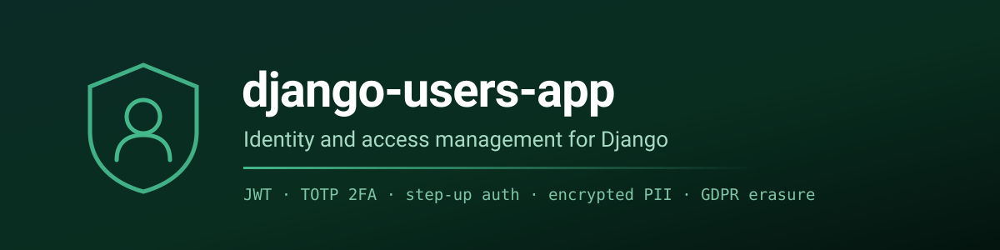

<div align="center">

[![Contributors][contributors-shield]][contributors-url]
[![Forks][forks-shield]][forks-url]
[![Stargazers][stars-shield]][stars-url]
[![Issues][issues-shield]][issues-url]
[![MIT License][license-shield]][license-url]
[![LinkedIn][linkedin-shield]][linkedin-url]

</div>

<a name="readme-top"></a>

<div align="center">
  
</div>

<p align="center">
  A reusable Django application for identity and access management —
  installed into your project, not cloned as one.
<br /><br />
<a href="docs/contracts/USERS_CONTRACT.md"><strong>Read the API contract »</strong></a>
<br />
·
<a href="https://github.com/GstMirabal/django-users-app/issues/new/choose">Report Bug</a>
·
<a href="https://github.com/GstMirabal/django-users-app/issues/new/choose">Request Feature</a>
</p>

<!-- TABLE OF CONTENTS -->
<details>
  <summary>Table of Contents</summary>
  <ol>
    <li>
      <a href="#about-the-project">About The Project</a>
      <ul><li><a href="#built-with">Built With</a></li></ul>
    </li>
    <li>
      <a href="#installing-it-in-your-project">Installing It In Your Project</a>
      <ul>
        <li><a href="#1-install-the-code">Install the code</a></li>
        <li><a href="#2-declare-it">Declare it</a></li>
        <li><a href="#3-provide-what-it-needs">Provide what it needs</a></li>
        <li><a href="#4-migrate">Migrate</a></li>
      </ul>
    </li>
    <li><a href="#working-on-the-app-itself">Working On The App Itself</a></li>
    <li><a href="#documentation">Documentation</a></li>
    <li><a href="#contributing">Contributing</a></li>
    <li><a href="#license">License</a></li>
    <li><a href="#contact">Contact</a></li>
  </ol>
</details>

## About The Project

A Django app that handles accounts, credentials and personal data, extracted
from a production system so it can be dropped into another one.

**This repository is not a project you run.** There is no `manage.py`, no
settings module and no compose file. It is the `users` package plus the tests
that prove it works, meant to be installed into a host project — for example
[Django-Pro-Template](https://github.com/GstMirabal/Django-Pro-Template), which
is the scaffold it is developed against.

**What it gives you:**

*   **JWT stateless authentication** — token rotation and blacklisting.
*   **TOTP two-factor** — enrolment with recovery codes, and anti-replay that
    holds across workers.
*   **Step-up authentication** — sensitive writes and irreversible deletion
    require recent re-authentication, for session and bearer-token clients
    alike.
*   **Encrypted personal data at rest** — Fernet encryption with HMAC blind
    indexes, so encrypted fields stay searchable by exact match.
*   **GDPR anonymisation** — irreversible erasure layered on soft deletion,
    with an append-only audit trail.
*   **Brute-force protection** — `django-axes` lockout that covers
    re-authentication, not only login.
*   **Password strength** — a 12-character minimum, complexity rules, and
    rejection of passwords found in public breach corpora.

Nine endpoints, each one specified in
[`USERS_CONTRACT.md`](docs/contracts/USERS_CONTRACT.md) with its fields, status
codes and permission gates.

### Built With

* 
* 
* 

Verified against Django 5.2 LTS and 6.0, at both ends of the supported range.

<p align="right">(<a href="#readme-top">back to top</a>)</p>

## Installing It In Your Project

> [!IMPORTANT]
> This app ships a custom `AUTH_USER_MODEL`. Django allows that to be set only
> before the first migration, so it goes into a **new** project — it cannot be
> added to one that already has auth data.

### 1. Install the code

Not published to PyPI. Vendor the `users/` package into your project — copy it,
or add this repository as a submodule and symlink the package — then install
the dependencies it declares:

```bash
git clone https://github.com/GstMirabal/django-users-app.git /tmp/users-app
cp -r /tmp/users-app/users your-project/
pip install -r /tmp/users-app/requirements.txt
```

`requirements.txt` lists only what the app itself imports. Your database
driver, web server and static-file handling stay your project's choice.

### 2. Declare it

```python
INSTALLED_APPS = [
    # ...
    "rest_framework",
    "rest_framework_simplejwt",
    "rest_framework_simplejwt.token_blacklist",
    "axes",
    "users",
]

AUTH_USER_MODEL = "users.User"
```

```python
# urls.py
urlpatterns = [
    path("api/v1/users/", include("users.urls")),
]
```

### 3. Provide what it needs

Four requirements, listed in full under *Host requirements* in the
[contract](docs/contracts/USERS_CONTRACT.md):

| Setting | Why |
| :--- | :--- |
| `MASTER_KEY` | Fernet key encrypting all personal data. |
| `ENCRYPTION_PEPPER` | Keys the blind indexes that keep encrypted fields searchable. |
| A cache **shared across workers** | TOTP anti-replay and step-up grants. On a per-process backend both fail silently under more than one worker. |
| `AXES_USERNAME_FORM_FIELD = "username"` | This app logs in by email; without this, `django-axes` records failed logins against nobody and lockout degrades from per-account to per-IP. |

The contract also lists the commands that generate the two keys, and what
rotating them costs.

### 4. Migrate

```bash
python manage.py migrate
```

<p align="right">(<a href="#readme-top">back to top</a>)</p>

## Working On The App Itself

The suite runs against `tests_harness/`, a minimal stand-in host, so no
database or cache service is needed.

```bash
python3 -m venv venv && source venv/bin/activate
pip install -r requirements-dev.txt

pytest -q          # 51 tests, in-RAM SQLite
ruff check .
```

The harness deliberately leaves `STEP_UP_WINDOW_SECONDS` and
`VERIFICATION_OTP_TTL_MINUTES` unset, so every run re-proves that a host is not
obliged to declare them.

<p align="right">(<a href="#readme-top">back to top</a>)</p>

## Documentation

| Document | What it answers |
| :--- | :--- |
| [`USERS_CONTRACT.md`](docs/contracts/USERS_CONTRACT.md) | What each endpoint accepts and returns, and what a host must provide. |
| [`USERS_BLUEPRINT.md`](docs/architecture/USERS_BLUEPRINT.md) | How the identity domain is built. |
| [`USERS_CUSTOMIZATION_GUIDE.md`](docs/guides/USERS_CUSTOMIZATION_GUIDE.md) | Which parts are the identity core and which extras you can strip. |
| [`docs/decisions/`](docs/decisions/) | Why each architectural choice was made, and what it cost. |
| [`GLOBAL_ROADMAP.md`](docs/roadmaps/GLOBAL_ROADMAP.md) | What is known to be missing. Including the gaps. |

<p align="right">(<a href="#readme-top">back to top</a>)</p>

## Contributing

Contributions are welcome. See the
[contribution guide](https://github.com/GstMirabal/.github/blob/main/CONTRIBUTING.md)
for the workflow and what a reviewable change looks like.

One rule worth repeating here: a bugfix should come with a test **checked to
fail without the fix**, not only to pass with it. Several defects in this
repository's history passed that second test while the first would have caught
them.

Security problems go through
[private advisories](https://github.com/GstMirabal/.github/blob/main/SECURITY.md),
never a public issue.

<p align="right">(<a href="#readme-top">back to top</a>)</p>

## License

Licensed under the MIT License. See [LICENSE.txt](LICENSE.txt) for more information.

<p align="right">(<a href="#readme-top">back to top</a>)</p>

## Contact

Gustavo Mirabal Suarez - gst.mirabal@gmail.com

- LinkedIn: [@Gustavo-Mirabal](https://www.linkedin.com/in/gstmirabal/)
- GitHub: [@GstMirabal](https://github.com/GstMirabal)
- Twitter: [@GstMirabal](https://x.com/gst_mirabal)

Project Link: [https://github.com/GstMirabal/django-users-app](https://github.com/GstMirabal/django-users-app)

<p align="right">(<a href="#readme-top">back to top</a>)</p>

<!-- MARKDOWN LINKS & IMAGES -->
[contributors-shield]: https://img.shields.io/github/contributors/GstMirabal/django-users-app.svg?style=for-the-badge
[contributors-url]: https://github.com/GstMirabal/django-users-app/graphs/contributors
[forks-shield]: https://img.shields.io/github/forks/GstMirabal/django-users-app.svg?style=for-the-badge
[forks-url]: https://github.com/GstMirabal/django-users-app/network/members
[stars-shield]: https://img.shields.io/github/stars/GstMirabal/django-users-app.svg?style=for-the-badge
[stars-url]: https://github.com/GstMirabal/django-users-app/stargazers
[issues-shield]: https://img.shields.io/github/issues/GstMirabal/django-users-app.svg?style=for-the-badge
[issues-url]: https://github.com/GstMirabal/django-users-app/issues
[license-shield]: https://img.shields.io/badge/license-MIT-blue.svg?style=for-the-badge
[license-url]: https://github.com/GstMirabal/django-users-app/blob/main/LICENSE.txt
[linkedin-shield]: https://img.shields.io/badge/-LinkedIn-black.svg?style=for-the-badge&logo=linkedin&colorB=555
[linkedin-url]: https://www.linkedin.com/in/gstmirabal/
